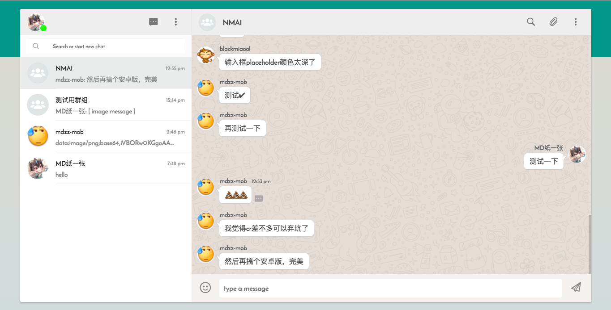
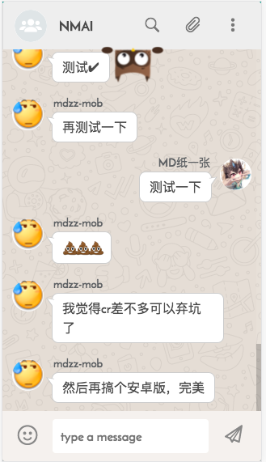

## NAMI－IM2.0
[](https://github.com/redsx)


NAMI取自LOL娜美，他源于之前的项目[CR](https://github.com/redsx/NAMI)，UI模仿whatsapp设计，
[点我去看看](http://nami.mdzzapp.com)

### 功能

1. 用户：包括注册、登录、个人信息管理、多端登录等
2. 消息：包括群聊、私聊、文件、图片、图片预览、表情、链接、ctrl+v快捷图片消息、消息撤回等
3. 群组：包括群组管理、通过链接邀请成员等
4. 设置：包括拒绝私聊消息、屏蔽用户、是否桌面提醒、是否预览消息、图片是否可见等
5. 其他：facvicon提醒、多语言

### 预览


 


### 安装

```
git clone https://github.com/redsx/CR.git
cd NAMI
npm install
npm run pro # 打包前端或者使用npm run dev (开发模式)
npm start # open server, open http://locahost:3002
```

### 建议

1. 检查是否安装mongodb以及node(V6.0+)
2. 可在@/server/config以及@/app/config对前后端进行配置

### NAMI后续

1. 可能会集成todo
2. 可能使用RN开发安卓版本(这个flag是作者的执念)
3. 找到解决音频文件过大的问题，上线语音消息(源码里有音频相关的一些实现)